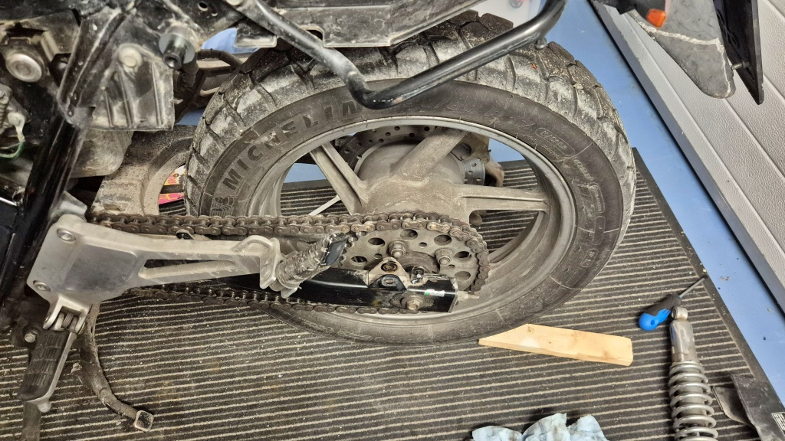
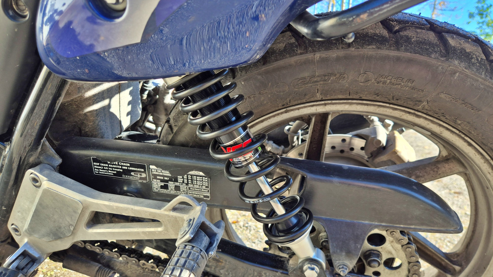
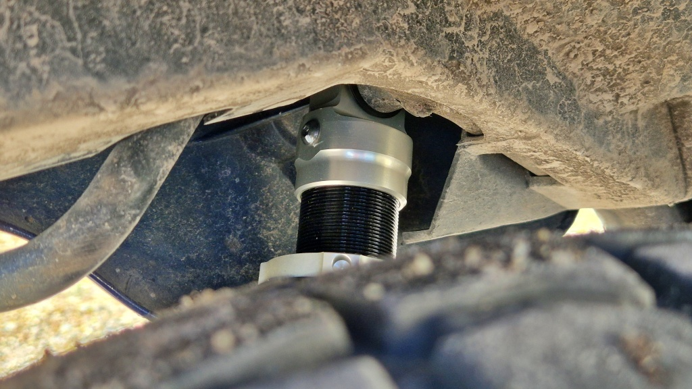

# Nya stötdämpare bak

Jag investerade i nya stötdämpare där bak. Kanske som en [30k tillsammans](../2026-09-20-30k-tillsammans/)-present? Jag vet inte riktigt vad jag förväntade mig, men... VARFÖR väntade jag 30 000 km?

<!--more-->

Egentligen var det litet av ett impulsköp. Jag beställde efter en hög med andra reservdelar från Wemoto och fick syn på CB 500-anpassade stötdämpare. Det kändes rätt förmånligt där i webbutiken (utan moms, tull eller transport). I slutändan blev det ändå nästan 320 €, vilket är det dyraste enskilda inköpet hittills till denna hoj. Det blev ett par YSS Plus Line E-series, vilket väl är YSS näst "förmånligaste" alternativ.

För att montera bort de gamla dämparna var jag givetvis tvungen att ta av den bakre kåpan men också ljuddämparen. Jag har inte haft loss den från grenröret tidigare, men det var inget stort jobb och det gick fint. När båda dämparna var borta passade jag på att känna hur svängarmens lager kändes. Mjuk rörelse, inga glapp – lagren verkar vara okej. Detta var annars en misstänkt orsak till vibrationerna jag känt på sista tiden.

Det var inte heller svårt att montera de nya dämparna: först pressa på dem på den övre tappen och sedan skruva fast dem nertill. Sedan på med ljuddämparen och på med kåporna igen. Jag passade också på att justera och smörja kedjan, och sedan var det klart.

Vad som kan konstateras redan nu är att justeringen av förspänningen blir krånglig att utföra. De gamla var jobbiga på så vis att jag inte hade något anpassat verktyg, men det funkade att pressa tillbaka fjädern med en stor skruvmejsel och sedan vrida med handkraft. För att justera de nya dämparna krävs verktyg. Först ska man lossa en liten insexlåsskruv, som är svår att nå under kåporna och dessutom kommer att vara full med lera och damm vad det lider. Sedan ska man vrida på den silverfärgade ratten med hjälp av det medföljande verktyget (det funkar säkert också med en lämplig skruvmejsel). Men ratten är också svår att nå bakom kåporna. Vidare är justeringen steglös, så man måste vara noga med att justera lika mycket på båda sidorna. Det blir antagligen att montera bort bakkåpan för att justera fjädringen, vilket i praktiken betyder att fjädringen sällan eller aldrig kommer att justeras. Ett steg bakåt.

Jag tog en provtur först följande dag, och ... ja, vilken skillnad! Jag hade tänkt att det där med stötdämpare nog är något som bara åkare med erfarenhet av många olika motorcyklar märker. Men också jag märkte hur mycket stabilare och jämnare det kändes.

De gamla dämparna var ställda med för hög förspänning, eftersom de hade en tendens att bottna i varje fall. Genast jag satte mig på hojen med de nya dämparna kändes att det fanns mera häng (en: sag), vilket det skall vara. Jag måste väl försöka justera in rätt nivå i något skede. Dessa borde i varje fall inte bottna lika lätt.

Där vi sedan åkte iväg kändes en verkligt stor skillnad i hur lugnt bakänden betedde sig. Jag är van vid att bakänden ska studsa lite grann vid varje liten ojämnhet, men nu försvann de små ojämnheterna helt. Grus och små gupp kändes betydligt mindre än förut. Större gupp känns ju fortfarande, men det känns som att hojen stabiliserar sig lite snabbare än förut efter guppet. Nu började jag i stället tycka att framgaffeln kändes långsam och klumpig, vilket jag aldrig reagerat på förut. Hela hojen kändes i varje fall lugnare på vägen på något sätt. Det märktes på asfalten på så sätt att jag kom upp i betydligt högre hastighet än jag tänkt – jag brukar ju känna när det är dags att sluta accelerera, men nu kom den känslan senare. Största skillnaden var kanske ändå på grusväg. Där jag tidigare känt att 70 km/h var lämpligt, kändes nu 90 km/h som helt komfortabelt. Hojen kändes mycket mer stabil och förtroendeingivande också på lösgrus.

Ännu återstår att testa hur de nya dämparna fungerar med packning eller med passagerare. Kanske behöver man justera förspänningen då. Men jag ser inte varför de nya inte skulle vara betydligt bättre än de gamla också där. Efter två korta provturer kan jag alltså konstatera att det känns bra, och tanken slår ju en: VARFÖR har jag kört 30 000 km med de gamla stötdämparna!

Ett problem som de nya dämparna inte åtgärdade var vibrationerna jag känner. Visserligen ger mjukare gång mindre vibrationer från däck och svingarm, men helt tydligt var inte stötdämparna orsaken till problemet. Jag kontrollerade också svingarmens lager, som verkade vara i skick. Alltså kvarstår frågan: Varifrån kommer vibrationerna? Däcken är bytta i år. Styrlagret är helt klart slitet och ska bytas när jag får tid, men det känns inte som om det orsakar vibrationerna, åtminstone inte alla vibrationer. Bakhjulets lager känns okej. Framhjulets lager kändes okej senast jag kollade, men jag ska snart lyfta upp nosen och kolla igen. Motorn går ändå hyfsat jämnt, jag tror inte att ojämn gång är boven. Vad återstår sedan att kolla? Ramlager eller vevlager? Det låter som ett mardrömsscenario, men det känns inte som rätt symtom för det heller. Nå, det klarnar väl med tiden.
